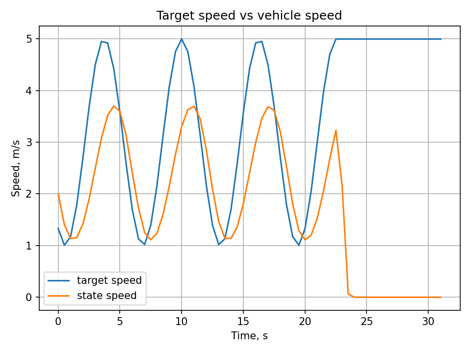
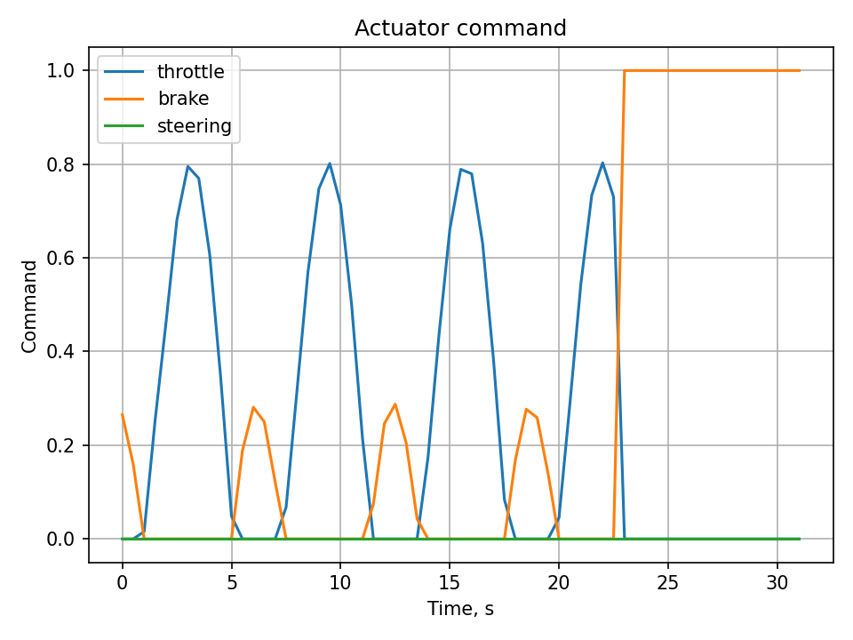
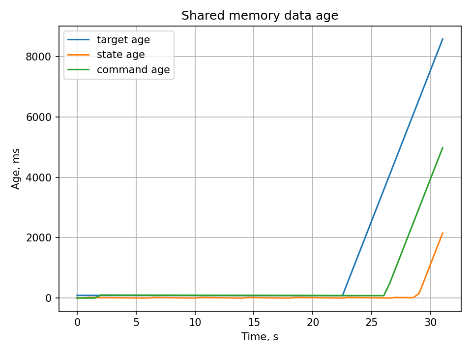

# POSIX Shared Memory Control Demo

This project is a small C++ demo of using POSIX shared memory for communication between several independent processes.

The project imitates a simplified robotics control architecture:

```text
planner
  writes desired target speed
      ↓
shared memory
      ↓
controller
  reads target + vehicle state
  writes actuator command
      ↓
shared memory
      ↓
can_driver_mock
  reads actuator command
  updates simulated vehicle state
      ↓
shared memory
      ↓
monitor
  reads and prints all shared data
````

The goal is to understand how shared memory can be used as a low-overhead IPC mechanism between a high-level robotics side and a soft real-time control side.

---

## Project structure

```text
shm_control_demo/
├── CMakeLists.txt
├── README.md
├── include/
│   ├── shared_data.hpp
│   └── shm_utils.hpp
└── src/
    ├── shm_init.cpp
    ├── planner.cpp
    ├── controller.cpp
    ├── can_driver_mock.cpp
    └── monitor.cpp
```

---

## Main idea

Shared memory is used only for data exchange.

The control algorithms are not “inside shared memory”. They run in normal C++ processes.

Shared memory contains fixed-layout data structures:

* `ControlTarget`
* `VehicleState`
* `ActuatorCommand`

Each data block is wrapped into a `SeqlockSlot<T>`:

```cpp
template <typename T>
struct SeqlockSlot {
    std::atomic<uint64_t> seq;
    T data;
};
```

The sequence counter is used to detect whether a reader observed data while a writer was updating it.

This design assumes:

* one writer per slot
* multiple readers are allowed
* shared structs are plain fixed-size data
* no `std::vector`, `std::string`, raw pointers, or dynamic allocation inside shared memory

---

## Build

From the project root:

```bash
cmake -S . -B build
cmake --build build -j$(nproc)
```

---

## Run

Run each process in a separate terminal.

First initialize shared memory:

```bash
./build/shm_init
```

Then start the planner:

```bash
./build/planner
```

Then start the controller:

```bash
./build/controller
```

Then start the CAN driver mock:

```bash
./build/can_driver_mock
```

Then start the monitor:

```bash
./build/monitor
```

Expected result: the monitor should show changing target speed, vehicle speed, and actuator commands.

Example:

```text
target_seq=2102 target_age_ms=41.4 target_speed=1.01
state_seq=9148 state_age_ms=13.1 state_speed=1.42
command_seq=1988 command_age_ms=35.4 throttle=0 brake=0.17 steering=0
```

---

## Processes

### `shm_init`

Creates and initializes the POSIX shared memory object.

It sets:

* magic value
* layout version
* initial target
* initial vehicle state
* initial actuator command

The shared memory object is available on Linux under:

```text
/dev/shm/shm_control_demo
```

---

### `planner`

Imitates a high-level planner or ROS2 bridge.

It writes a changing `ControlTarget` into shared memory.

Currently it generates a simple sinusoidal target speed:

```cpp
target.target_speed_mps = 3.0 + 2.0 * std::sin(t_sec);
```

---

### `controller`

Imitates a soft real-time controller.

It reads:

* `ControlTarget`
* `VehicleState`

Then it computes:

* throttle
* brake
* steering

The current speed controller is a simple proportional controller:

```text
speed_error = target_speed - current_speed
```

If the error is positive, throttle is applied.

If the error is negative, brake is applied.

The controller also checks data freshness. If target or state is stale, it writes a safe stop command:

```text
throttle = 0
brake = 1
steering = 0
```

---

### `can_driver_mock`

Imitates a CAN driver and vehicle dynamics.

It reads `ActuatorCommand` and updates `VehicleState`.

The model is intentionally simple:

```text
acceleration = throttle_acceleration - brake_deceleration - drag
```

It is not physically accurate, but it is enough to close the control loop.

---

### `monitor`

Reads all shared-memory slots and prints:

* sequence numbers
* data age
* target speed
* vehicle speed
* throttle
* brake
* steering

This process is useful for debugging shared-memory communication.

---

## Why magic and version are used

The shared memory layout starts with:

```cpp
uint32_t magic;
uint32_t version;
```

`magic` checks that the opened shared memory object is probably the expected one.

`version` checks that the process expects the same memory layout as the initialized shared memory.

This helps catch mistakes such as:

* shared memory was not initialized
* wrong shared memory name was opened
* old shared memory object remained from a previous program version
* struct layout changed but old shared memory still exists

---

## Seqlock pattern

Each slot has a sequence counter.

Writer:

```cpp
seq++;        // odd: write started
data = value;
seq++;        // even: write finished
```

Reader:

```cpp
do {
    seq_before = seq;
    copy = data;
    seq_after = seq;
} while (seq_before != seq_after || seq_before is odd);
```

This allows readers to obtain a consistent copy without using a mutex.

Important limitation: this pattern assumes only one writer per slot.

---

## Current data flow

```text
ControlTarget:
    written by planner
    read by controller and monitor

VehicleState:
    written by can_driver_mock
    read by controller and monitor

ActuatorCommand:
    written by controller
    read by can_driver_mock and monitor
```

---

## Reset shared memory

If the layout changes or the program behaves strangely, remove the old shared memory object:

```bash
rm /dev/shm/shm_control_demo
```

Then run:

```bash
./build/shm_init
```

---

## Notes

This project is for learning. It demonstrates useful concepts for robotics software architecture:

* POSIX shared memory
* `shm_open`
* `ftruncate`
* `mmap`
* fixed-layout shared structs
* sequence-counter synchronization
* stale-data checking
* simple closed-loop control
* separation between high-level planning and low-level control

For a real robot, additional work would be needed:

* process scheduling policy
* CPU affinity
* watchdog process
* robust safety checks
* real CAN interface
* better vehicle model
* real controller design
* logging and diagnostics
* ROS2 bridge process

## Demo

After running the processes and collecting `shm_log.csv`, generate plots:

```bash
python3 scripts/plot_log.py
```

### Target speed vs vehicle speed



### Actuator commands



### Shared memory data age

